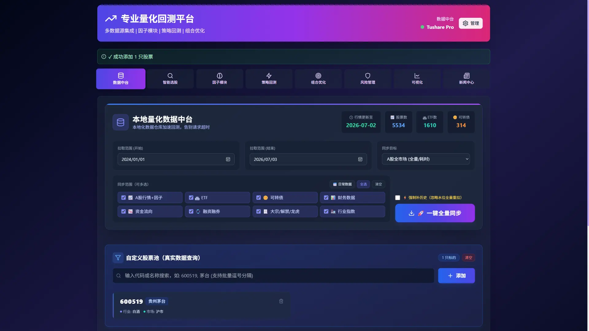
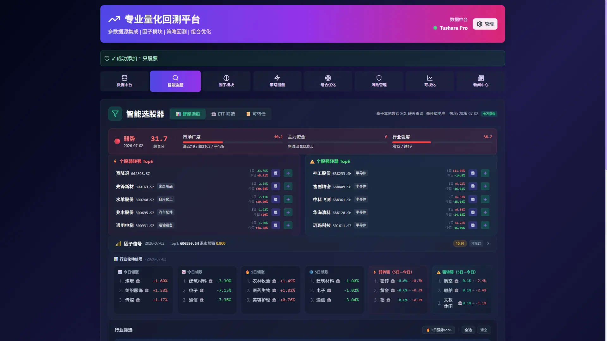
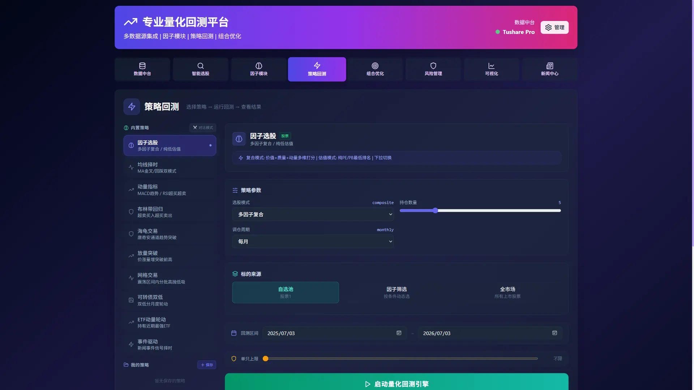
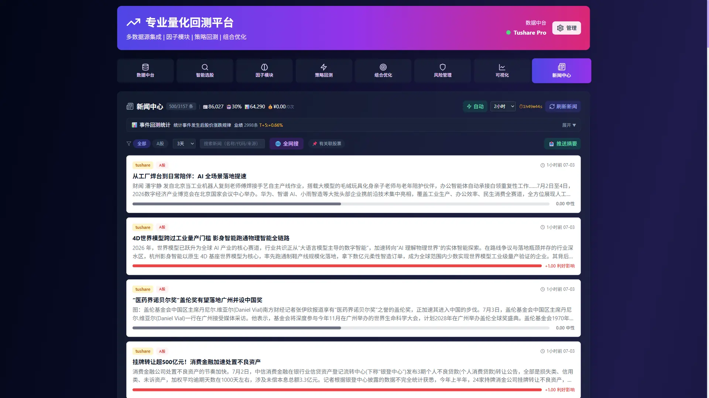

<h1 align="center">QFO量化回测平台</h1>

<p align="center">
  <strong>QFO Quant Platform · A 股本地化量化回测与数据分析平台</strong>
</p>

<p align="center">
  <a href="LICENSE"></a>
  
  
  
  
  
</p>

<p align="center">
  面向 A 股量化研究的本地化量化回测平台，覆盖 A股量化回测、股票量化回测、数据同步、智能选股、因子研究、策略回测、组合优化、风险分析、可视化分析、新闻情绪和推送通知。
</p>

<p align="center">
  <a href="#产品预览">产品预览</a> ·
  <a href="#功能特性">功能特性</a> ·
  <a href="#快速开始">快速开始</a> ·
  <a href="#技术栈与数据来源">技术栈与数据来源</a> ·
  <a href="#推送通知">推送通知</a> ·
  <a href="https://qfo-website-yyy18337s-projects.vercel.app/">教学网站</a> ·
  <a href="CONTRIBUTING.md">贡献说明</a> ·
  <a href="LICENSE">MIT License</a>
</p>

## 项目亮点

QFO 是一个面向 A 股量化分析的本地化量化回测平台，适合在个人电脑上完成 A股量化回测、股票量化回测、数据同步、股票与 ETF 筛选、因子研究、策略回测、组合优化、风险分析、K 线可视化和新闻情绪跟踪。

- 本地运行：后端、前端、SQLite 数据库都在本机运行，敏感配置不会上传到 Git。
- 多数据源：以 Tushare Pro 为主，结合 AkShare、BaoStock 做补充。
- 一体化流程：从数据同步到选股、回测、组合和风险分析，尽量减少手工切换工具。
- 首次运行友好：提供 `run_first_time.bat` 自动创建环境、安装依赖并启动服务。

## 产品预览

更多页面和使用说明可访问：[QFO 教学网站](https://qfo-website-yyy18337s-projects.vercel.app/)。

| 数据中台 | 智能选股 |
| --- | --- |
|  |  |

| 策略回测 | 新闻中心 |
| --- | --- |
|  |  |

## 快速开始

### 1. 环境要求

请先在电脑上安装：

- Windows 10/11
- [Python 3.12+](https://www.python.org/downloads/)
- [Node.js 18+](https://nodejs.org/)
- [Git](https://git-scm.com/downloads)

### 2. 下载项目

```bash
git clone <你的仓库地址>
cd QFO
```

### 3. 首次运行

第一次从 Git 下载项目后，推荐直接双击运行：

```text
run_first_time.bat
```

`run_first_time.bat` 会自动完成：

- 检查 Python 是否可用
- 检查 Node.js 是否可用
- 创建后端虚拟环境 `backend/.venv`
- 安装后端依赖
- 安装前端依赖 `frontend/node_modules`
- 如果没有 `backend/.env`，自动从 `backend/.env.example` 创建
- 启动后端服务
- 启动前端页面

启动成功后访问：

```text
后端 API: http://localhost:8000
前端页面: http://localhost:3000
```

### 4. 填写 Tushare Token

首次进入系统后，打开页面右上角设置，填写自己的 Tushare Token 并保存。

`backend/.env` 是本地配置文件，里面可能包含 Token 或 API Key，不会上传到 Git。

## 启动脚本说明

### run_first_time.bat

推荐首次运行、新电脑运行、刚从 Git 下载项目后使用。

它会检查环境、安装依赖、创建 `.env`，适合完整初始化项目。

### run_quick_start.bat

日常快速启动使用。

它默认你已经运行过 `run_first_time.bat`，并且本地已经存在：

- `backend/.venv`
- `frontend/node_modules`
- `backend/.env`

如果是第一次下载项目，不建议直接运行 `run_quick_start.bat`。

## Git 上传说明

项目源码需要整体上传到 Git，尤其确认以下关键文件和目录存在：

```text
backend/
frontend/
run_first_time.bat
run_quick_start.bat
backend/.env.example
backend/requirements.txt
frontend/package.json
frontend/package-lock.json
README.md
.gitignore
```

首次上传到 GitHub 可以参考：

```bash
git add -A
git commit -m "Initial project setup"
git remote add origin <你的仓库地址>
git branch -M main
git push -u origin main
```

以下文件不会上传到 Git：

```text
backend/.env
backend/.venv/
frontend/node_modules/
backend/quant_data.db
backend/quant_data.db-wal
backend/quant_data.db-shm
backend/cache_data/
backend/logs/
```

这些都是本地环境、敏感配置、数据库、缓存或运行日志。

## 手动启动方式

如果不使用启动脚本，也可以手动启动。

### 后端

```bash
cd backend
python -m venv .venv
.venv\Scripts\activate
pip install -r requirements.txt
copy .env.example .env
python -m uvicorn main:app --host 0.0.0.0 --port 8000 --reload
```

### 前端

```bash
cd frontend
npm install
npx vite --port 3000
```

访问：

```text
后端 API: http://localhost:8000
前端页面: http://localhost:3000
```

## 配置说明

常用配置项在 `backend/.env` 中管理，也可以通过前端设置页面修改。

| 配置项 | 是否必填 | 说明 |
| --- | --- | --- |
| `TUSHARE_TOKEN` | 必填 | Tushare Pro Token |
| `TAVILY_API_KEY` | 可选 | Tavily 搜索 API Key，用于增强新闻模块 |
| `LLM_SILICONFLOW_KEY` | 可选 | SiliconFlow API Key，用于新闻情绪和研报摘要 |
| `LLM_ANSPIRE_KEY` | 可选 | Anspire API Key，用于新闻情绪和研报摘要 |
| `TELEGRAM_*` | 可选 | Telegram 推送通知配置 |
| `WECHAT_WEBHOOK_URL` | 可选 | 企业微信/微信机器人 Webhook |

## 功能特性

- 📊 **数据中台**：Tushare Pro + AkShare + BaoStock 三源降级，覆盖 A 股、ETF、可转债、财务数据、资金流向、融资融券、行业指数和事件数据。
- 🔍 **智能选股**：支持估值、成长、盈利、资金、行业轮动、事件驱动、技术趋势和新闻情绪等多条件筛选。
- 🧠 **因子模块**：覆盖价值、质量、动量、规模、低波、成长、红利、筹码集中等因子，支持综合评分和因子诊断。
- ⚡ **策略回测**：内置多因子、MACD/RSI、布林带、海龟、网格、放量突破、ETF 动量和事件驱动等策略。
- 🎯 **组合优化**：支持最大夏普、最小方差、风险平价和等权配置，辅助构建更稳定的组合方案。
- 🛡️ **风险管理**：计算 VaR、CVaR、最大回撤、Beta、Sortino 等指标，并支持基准对比分析。
- 📈 **可视化**：提供 K 线图、资金流向、技术诊断、因子表现和回测收益曲线等图表分析。
- 📰 **新闻中心**：聚合多源新闻，支持 LLM 情绪分析、事件识别、事件回测、新闻自动抓取和摘要推送。

## 支持能力

### 支持策略

当前内置多种回测策略，包括多因子选股、均线择时、MACD/RSI 动量、布林带回归、海龟交易、放量突破、ETF 动量轮动、可转债双低、网格交易和事件驱动策略。

### 支持因子

因子体系覆盖反转、价值、质量、规模、动量、低波、成长、红利、筹码集中和杠杆情绪等维度，可用于综合评分、选股和策略回测。

### 数据源机制

平台以 Tushare Pro 为主力数据源，结合 AkShare、BaoStock 做补充。已同步的数据优先读取本地 SQLite，减少重复 API 请求；未入库或实时查询场景再按需访问外部数据源。

## 项目结构

```text
backend/                 后端 API、数据同步、业务服务
backend/routers/         FastAPI 路由
backend/services/        核心业务逻辑
backend/jobs/            数据同步和定时任务
backend/models/          数据库模型
backend/tests/           后端测试
frontend/                React 前端
frontend/src/components/ 页面组件
run_first_time.bat       首次运行脚本
run_quick_start.bat      日常快速启动脚本
```

## 测试命令

前端测试：

```bash
cd frontend
npm test
```

后端本地测试：

```powershell
cd backend
$tests = Get-ChildItem tests -Filter "test_*.py" | ForEach-Object { $_.FullName }
.venv\Scripts\python.exe -m pytest $tests
```

`backend/tests/quick_connection_test.py` 会连接外部数据源，适合手动检查 Tushare、AkShare、BaoStock 等连接状态，不作为普通本地测试必跑项。

## 技术栈与数据来源

| 类别 | 说明 |
| --- | --- |
| 后端 | Python、FastAPI、SQLAlchemy、SQLite |
| 前端 | React、Vite、TailwindCSS、Recharts、TradingView Charts |
| 数据源 | Tushare Pro 为主，AkShare、BaoStock 补充 |
| 本地存储 | SQLite 本地数据库优先读取，减少重复 API 请求 |
| AI 能力 | 可选接入 SiliconFlow、Anspire 等 LLM 渠道，用于新闻情绪和研报摘要 |

## 推送通知

QFO 支持新闻摘要、精选新闻和高分事件推送。推送能力默认关闭，用户可在设置页配置后启用。

当前代码支持 Telegram、企业微信/微信机器人、PushPlus、Server酱、飞书和通用 Webhook 等渠道；其中 `backend/.env.example` 预留了 Telegram 和企业微信 Webhook 的基础配置。

推送配置属于本地私有配置，运行时会写入 `backend/.notify_config.json`，该文件已被 `.gitignore` 排除，不会上传到 Git。

## 常见问题

### 运行后提示 Python not found

请先安装 Python，并确认安装时勾选了 `Add Python to PATH`。

### 运行后提示 Node.js not found

请先安装 Node.js，然后重新打开命令行或重新双击启动脚本。

### 首次运行很慢

首次运行会安装 Python 和 Node.js 依赖，耗时取决于网络环境。安装完成后，后续启动会快很多。

首次同步数据还取决于本地是否已有数据库水位、是否勾选“强制补历史（忽略水位全量重拉）”、Tushare 积分额度和网络稳定性。以 `2024-01-01` 到 `2026-07-17` 为例：

- **日常已有水位的增量同步，约 2 分钟属于正常且很快的水平。**
- **空库首次建仓或强制补历史**，会重新拉取股票、ETF、可转债、指数、资金流等历史数据，**通常需要 1～4 小时**；如果同时包含财务报表、股东户数等慢接口，耗时可能继续增加。
- **“财务报表最新 2026-06-30”这类日期是正常的季报/中报报告期日期，不是同步当天日期**；财报数据通常按季披露，存在自然滞后。**如果同步日志显示“财务数据：跳过”，则本次不会消耗财报拉取时间；如果单独拉取最新季报/中报，通常需要数分钟到十几分钟；首次建仓或强制补历史拉取多期财报时，可能需要几十分钟到数小时。**
- **强制补历史适合首次建仓、修复缺口或主动重建数据库，不建议作为每天常规同步方式。**

### 没有数据

请先在设置页面填写自己的 Tushare Token，然后到数据中台同步数据。

## 免责声明

本项目仅用于量化研究、策略验证和编程学习，不构成任何投资建议、交易建议或收益承诺。股票、基金、可转债等金融资产存在风险，历史回测结果不代表未来表现。使用者应自行判断数据质量、策略风险和交易后果。

## 联系与反馈

| 类型 | 方式 |
| --- | --- |
| 合作邮箱 | yyy18337@gmail.com |
| 问题反馈 | [提交 Issue](https://github.com/yeh2017/QFO-Quant-Platform/issues) |

## License

[MIT License](LICENSE) © 2026 yeh2017

欢迎在二次开发或引用时注明本仓库来源，感谢支持项目持续维护。
